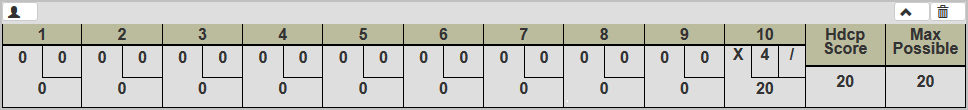

# Trabajo Práctico N°2: Test-Driven Development

En el siguiente trabajo se realizo una práctica de desarrollo de una aplicación para jugar Bowling utilizando la metodología de TDD (Test-Driven Development). Los ejemplos de juegos de bowling se obtuvieron del sitio web: [Bowling Genius](https://www.bowlinggenius.com/). Este proyecto continua la consigna base planteada en el repositorio: [mgarriga/tdd-homework](https://github.com/mgarriga/tdd-homework).

## Descripción de la Metodología

Esta metodología consiste en desarrollar aplicaciones en una serie de ciclos, donde cada ciclo consiste en 3 pasos diferentes:

1. **ROJO**: se escribe uno o varios tests representativos de la funcionalidad a desarrollar en la aplicación. Luego, se ejecutan dichos tests y se observa el resultado, el cual (normalmente), resultara en un test fallido. 
2. **VERDE**: se desarrollan o modifican los modulos dentro de la aplicación y se continúan ejecutando los tests hasta que estos dan un resultado positivo, es decir, se pudo lograr que el sistema cumpla con la funcionalidad deseada. 
3. **REFACTOR**: una vez que se garantiza que el sistema cumple con la funcionalidad definida en el primer paso, se **Refactoriza**. Esta es una técnica que implica *alterar su estructura interna sin cambiar su comportamiento externo*, en otras palabras, se **limpia el código**. Esto significa revisar los modulos creados o modificados para generalizar el código con la intención de que pueda ser reutilizado, renombrar variables por nombres mas significativos, crear subrutinas a partir de secciones del código, etc.

El proposito de esta metodología es desarrollar la funcionalidad requerida por el sistema. Esto nos permite que, al finalizar el proceso, se pueda garantizar que el software cumple con los requerimientos establecidos.

### Ejemplo de ciclo

El siguiente ejemplo muestra un ejemplo de un ciclo con sus 3 etapas y corresponde al [Ciclo 6](#-6.-Sexto-Ciclo) del desarrollo del sistema. Puede observarse todos los cambios realizados viendo el historial de los commits realizados en esa branch (bajo el *historial de commits* > *commit a analizar* > *split* para ver los cambios en esa etapa).

1. **ROJO**: Se plantearon los casos de test para distintos juegos cuyo resultado en la última ronda llevan a necesitar un 3<sup>er</sup> tiro en la ronda N° 10. Al ejecutar el test se observa que ninguno pudo ejecutarse correctamente, por lo que se necesita desarrollar la nueva funcionalidad.

*imagen

2. **VERDE**: Se modifico en `bowling.py` la función de `play_bowling(current_score, rolls, pins)` y se agrego una nueva función llamada `ronda10(pins)` que asistía en resolver la nueva funcionalidad. Estos cambios permitieron resolver los tests planteados en la etapa anterior.

*imagen

3. **REFACTOR**: Se incorporo la función `ronda10(pins)` dentro de la función ya existente `play_bowling(current_score, rolls, pins)`.

## Casos de Test

Para cada ciclo se plantearon distintos casos de test que llevaron al desarrollo de dinstintas funcionalidades en la aplicación (cada una desarrollada en su propia *branch*). Los casos y las imagenes fueron generadas con el sitio web Bowling Genius. Los primeros dos ciclos fueron implementados en el repositorio base.

### 1. Primer Ciclo

```python
def test_all_gutter():
```

Se establece la primer funcionalidad, de un juego de 20 tiros y 0 pines tirados en cada uno.


### 2. Segundo Ciclo

```python
def test_all_ones():
```

Un juego de 20 tiros y 1 pin tirado en cada uno.


### 3. Tercer Ciclo

```python
def test_spare():
```

Un juego donde los primeros 2 tiros producen una *media chuza* (o *spare*) y 18 tiros siguientes con 1 pint tirado en cada uno.


### 4. Cuarto Ciclo

```python
def test_strike():
```

Un juego donde el primer tiro produce una *chuza* (o *strike*) y 18 tiros siguientes con 1 pint tirado en cada uno.


### 5. Quinto Ciclo

```python
def test_mezcla_strike_spare():
```

Un juego de 20 tiros con valores varios en cada uno, con una *media_chuza* en la ronda 3 y una *chuza* en la ronda 8.


### 6. Sexto Ciclo

```python
def test_ronda_10_all_strike():
def test_ronda_10_strike_spare():
def test_ronda_10_strike():
def test_ronda_10_spare_strike():
def test_ronda_10_spare():
```

5 juegos donde los primeros 18 tiros tiran 0 pines, y los ultimos 3 tiros prueban distintas combinaciones (en cada juego) de *medias_chuzas* y una *chuzas* para analizar todos los casos posibles al final del juego.

*Chuza* en cada tiro


*Chuza* y *media chuza*


*Chuza* y valores comunes


*Media chuza* y *chuza* 


*Media chuza* y valor común 


### 7. Séptimo Ciclo

```python
def test_all_strike():
```

Un juego de 12 tiros con 10 pines tirados en cada uno. Esto lleva a computar situaciones con multiples *chuzas* activas en un mismo momento.


### 8. Octavo Ciclo

```python
def test_score():
def test_pins():
def test_rondas():
```

Se prueban tiros con valores de máximo y mínimo puntaje permitido, máximo y mínimo de pines en un tiro, máximo en dos tiros de una misma ronda y valores máximos y mínimos en cantidad de tiros.

## Versiones

### v0.1 *"Inicio del Trabajo"*

* Incorpora el primer ciclo de test.
* Permite partidas de todos 0.

### v0.2 *"Actualización del Proyecto"*

* Incorpora el segundo ciclo de test.
* Permite partidas de todos 0 y 1.

### v0.3 *"Implementación Juego Normal"*

* Incorpora el tercer, cuarto y quinto ciclo.
* Permite cualquier partida que no termine con una *chuza* o *media chuza* en la ronda 10.

### v1.0 *"Versión Alpha"*

* Incorpora el sexto y séptimo ciclo. 
* Permite cualquier tipo de juego válido.

### v1.1 *"Entrega Final"*

* Incorpora el octavo ciclo y el README.
* Permite cualquier tipo de juego y devuelve un error si algun parámetro no es válido. 
* Se incorpora el README como informe del trabajo realizado.

## Conclusión 

Con este trabajo se pudo aprender la metodología de TTD propuesta en la materia, con la aplicación del flujo de trabajo GitFlow. El uso de TDD fue satisfactorio, porque nos permitía ir desarrollando la aplicación por medio de casos de test que representaban las funcionalidades del sistema, en vez de pensar desde el comienzo en una solución completa para el problema. De esta manera, la forma de trabajar se sintió más rápida, estructurada, y permitió que el código generado este ordenado y comprensible. Aún así, por estar acostumbrados a pensar la solución completa por partes, se nos hizo complicado al principio entender la forma de trabajo, porque el dominio era bastante simple. Una vez que llegamos a las partes finales, si nos ayudó porque cada feature aumentaba de complejidad y pensar en su solución se hizo más fácil.

En cuanto a la metodología de GitFlow, fue muy interesante, porque a medida que fuimos avanzando en el trabajo, pudimos ir registrando los cambios que le fuimos haciendo al código, lo que nos permitó guiarnos sobre que punto nos habíamos quedado al retomar el desarrollo. También nos ayudó a completar nuestros conocimientos sobre el uso de Git, porque ya lo utilizabamos, pero sin las convenciones para crear branchs, para escribir los nombres de commits, creación de pull requests. Y como consideración a futuro, o para los que vean el repositorio, pueden ser capaces de observar cómo el trabajo fue evolucionando.